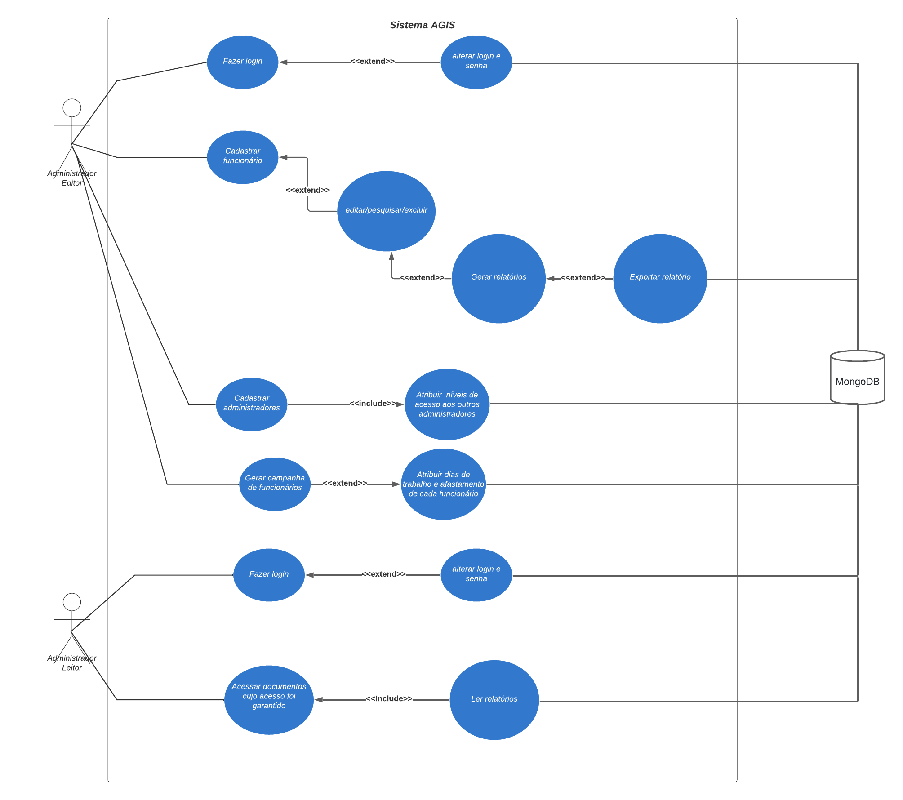

# Visões de Casos de Uso

Os casos de uso do Sistema AGIS são simples e diretos, focando nas principais funcionalidades administrativas e de acesso de usuários. O Administrador pode realizar ações como fazer login, cadastrar funcionários (incluindo atribuir níveis de acesso), editar, pesquisar e excluir dados, além de gerar e exportar relatórios (inclui relatório mensal, campanhas e escalas). O Usuário pode fazer login, acessar documentos cujo acesso foi autorizado e ler relatórios. Ambos os tipos de usuários têm a possibilidade de alterar login e senha. Este fluxo simples facilita a gestão de usuários e documentos, integrando todas essas funcionalidades de forma clara e eficiente.

*Figura 2: Desenho esquemático de casos de uso.*