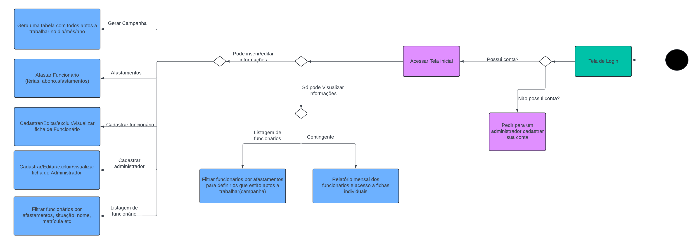

# Diagrama de Atividades

*Figura 4: Desenho esquemático do diagrama de atividades*

Este diagrama de atividades representa um fluxo de trabalho para um sistema de gerenciamento de funcionários, detalhando as diferentes etapas e decisões envolvidas no processo. Aqui está a explicação passo a passo:

1. **Tela de Login**:
    - O usuário inicia acessando a Tela de Login.
    - É feita uma verificação se o usuário possui uma conta:
        - Se sim, ele acessa a Tela Inicial.
        - Se não, ele deve pedir para um administrador cadastrar esta conta.

2. **Tela Inicial**:
    - Dependendo das permissões do usuário, ele pode:
        - Inserir/Editar informações, ou
        - Apenas visualizar informações.

3. **Ações Disponíveis**:
    - **Gerar Campanha**: Gera uma tabela com todos os funcionários aptos a trabalhar no dia/mês/ano.
    - **Afastar Funcionários**: Afastar funcionários por férias, abono, ou outros motivos de afastamento.
    - **Cadastrar/Editar/Excluir/Visualizar Ficha de Funcionário**: Gerenciar os dados dos funcionários.
    - **Cadastrar/Editar/Excluir/Visualizar Administrador**: Gerenciar os dados dos administradores.
    - **Listagem de Funcionários**: Exibir uma lista de todos os funcionários.

4. **Filtragem e Relatórios**:
    - Na Listagem de Funcionários, o usuário pode filtrar por:
        - Afastamentos,
        - Funcionários aptos a trabalhar.
    - Também pode gerar Relatório com base nas informações filtradas.

5. **Decisões**:
    - As permissões do usuário determinam se ele pode inserir/editar informações ou só visualizar informações:
        - Se o usuário pode inserir/editar, ele pode realizar todas as ações descritas.
        - Se o usuário só pode visualizar, ele tem acesso limitado às informações.

Este diagrama ilustra o fluxo lógico do sistema desde o login até a execução de várias operações de gerenciamento de funcionários, com base nas permissões do usuário.

