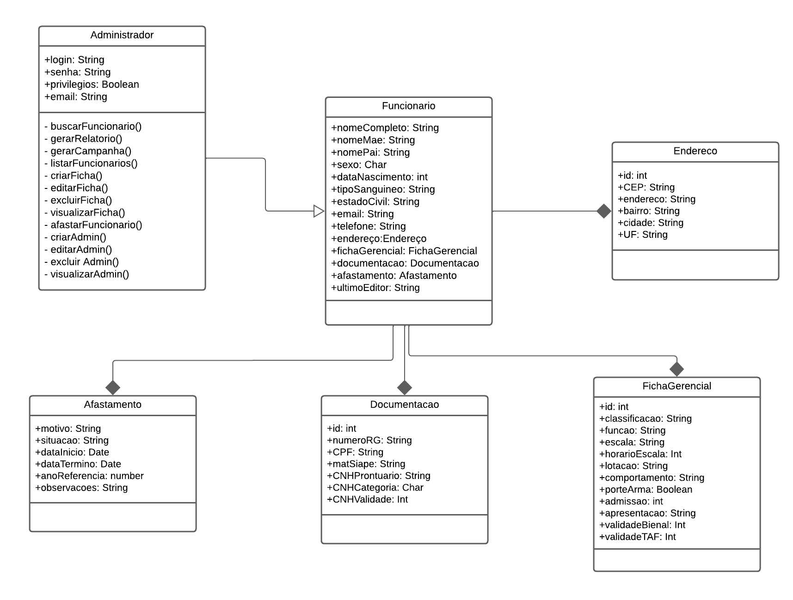

# Diagrama de Classes e Pacotes

*Figura 5: Desenho esquemático do diagrama de classes*

Esse diagrama de classes representa um modelo de dados para um sistema de gerenciamento de funcionários, mostrando como as diferentes entidades do sistema estão relacionadas entre si e quais atributos e métodos elas possuem. Vamos detalhar cada uma das classes e suas relações:

## Detalhamento das Classes

### Classe Administrador
- **Atributos**:
  - login
  - senha 
  - privilegios
  - email
- **Métodos**:
  - busca
  - criação
  - edição
  - exclusão de fichas
  - geração de relatórios
  - geração de campanhas
  - listagem de funcionários
  - visualização de fichas
  - afastamento de funcionários

### Classe Funcionário
- **Atributos**:
  - diversos atributos pessoais e profissionais e último editor
- **Relações**:
  - **Endereço**: cada funcionário tem um endereço
  - **FichaGerencial**: cada funcionário tem uma ficha gerencial
  - **Documentação**: cada funcionário possui documentos associados

### Classe Endereço
- **Atributos**:
  - CEP
  - endereço
  - bairro
  - cidade
  - unidade federativa (UF)

### Classe FichaGerencial
- **Atributos**:
  - classificação
  - função
  - escala
  - lotação
  - comportamento
  - porte de arma
  - datas de admissão e apresentação
  - validade de certificações e exames

### Classe Documentação
- **Atributos**:
  - RG
  - CPF
  - matrícula SIAPE
  - CNH (Carteira Nacional de Habilitação) com prontuário
  - categoria e validade

### Classe Afastamento
- **Atributos**:
  - motivo
  - situacao
  - datas de início e término
  - ano de referência
  - observacoes

## Relações entre as Classes
- A classe Funcionário tem uma associação com a classe Endereço, indicando que cada funcionário tem um endereço.
- A classe Funcionário tem uma associação com a classe FichaGerencial, indicando que cada funcionário tem uma ficha gerencial.
- A classe Funcionário tem uma associação com a classe Documentação, indicando que cada funcionário possui documentos associados.
- A classe Funcionário tem uma associação com a classe Afastamento, indicando que cada funcionário possui afastamentos associados.

Esse diagrama de classes fornece uma visão estruturada do sistema, especificando como os dados sobre funcionários são organizados e manipulados.

## Pacotes

*Figura 6: Desenho esquemático do diagrama de pacotes*

Quanto ao diagrama de pacotes, apresenta os seguintes componentes principais: a Interface de Usuário, responsável pela interação direta com os usuários, e a Lógica de Apresentação, que manipula e transforma dados para a interface; os Serviços de Negócio, que implementam as regras de negócios e processos centrais do sistema; os Repositórios de Dados, que gerenciam operações de persistência e recuperação de dados armazenados; e o Banco de Dados MongoDB, que armazena os dados de maneira persistente utilizando um banco de dados NoSQL.