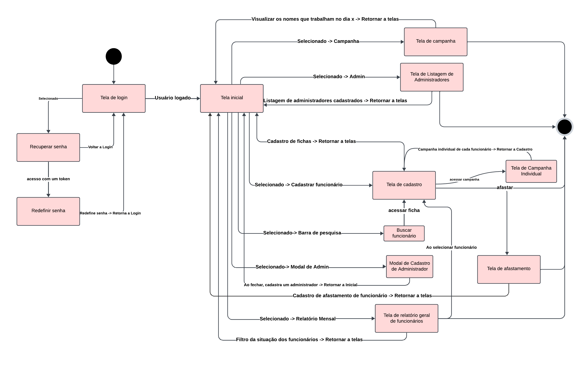

# Representação do Diagrama de Estados

*Figura 3: Desenho esquemático do diagrama de estados*

O diagrama de estados é aplicado para demonstrar o comportamento geral do sistema, mostrando os estados e transições do funcionamento assim como quais eventos levam a transição de um estado para outro do AGIS. Assim, é possível compreender o funcionamento da aplicação desktop conforme é utilizado. A aplicação começa pela:

1. **Tela de login**: Para ter acesso ao sistema, os usuários terão que fazer login. Os usuários são divididos em Administrador Editor e Administrador Leitor, sendo o primeiro capaz de cadastrar funcionários e gestar suas campanhas enquanto o segundo apenas lê. Caso o administrador esqueça a senha, o mesmo será direcionado para uma tela de redefinição de senha.

2. **Tela Inicial**: Caso o usuário efetue o login com sucesso, ele terá acesso à tela inicial, que oferece acesso a todas as outras telas do sistema, sendo elas:
    - **Tela de Listagem de Administrador**
    - **Tela de Campanha**
    - **Tela de Campanha Individual**
    - **Tela de Cadastro**
    - **Tela de Afastamento**
    - **Tela de Relatório Mensal**
    - **Modal de Cadastro de Administrador**
    
Além disso, na Tela Inicial, será possível realizar buscas de todos os funcionários cadastrados, permitindo o acesso às suas fichas e ao cadastro de afastamentos. Após acessar os serviços desejados, é possível voltar à Tela Inicial, acessar outras telas e, também, sair do programa.

