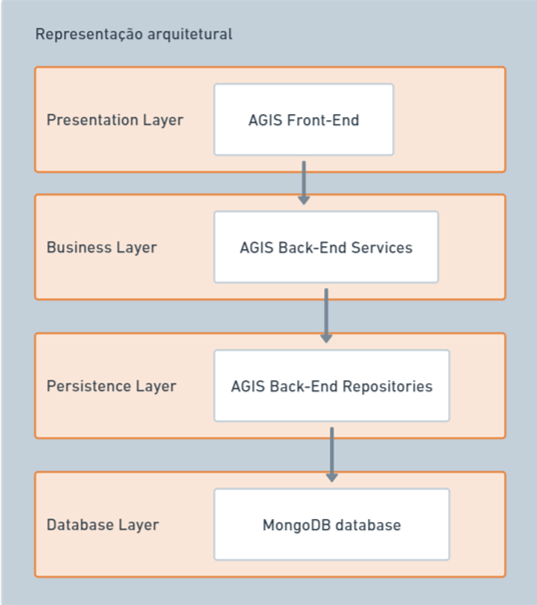

## 2.1 Definições
O sistema seguirá uma Arquitetura em Camadas.

## 2.2 Motivo da escolha
A arquitetura em camadas possui o formato ideal para a implementação de CRUDs, conceito que será amplamente usado no decorrer do projeto. Dado o contexto de utilização do nosso software, será imprescindível focar no que será mostrado, além de ter uma camada para aplicação de regras de negócio e para a persistência dos dados.

Há também benefícios para o processo de desenvolvimento, tendo em vista que essa arquitetura possibilita delimitar bem o escopo de atuação de cada membro e também que cada componente nele inserido seja testado separadamente, possibilitando, assim, uma maior abrangência de testes.

## 2.3 Detalhamento
A ideia por trás da Arquitetura em Camadas é que os módulos com funcionalidades semelhantes são organizados em camadas horizontais. Esse estilo de arquitetura abstrai a visão do sistema como um todo e, ao mesmo tempo, fornece detalhes suficientes para entender as funções e responsabilidades de cada camada e o relacionamento entre elas.

A camada de apresentação contém todas as classes responsáveis por apresentar a UI/visualização para o usuário final e pelo tratamento da lógica de comunicação do navegador. É a camada com a qual os clientes interagem.

Já a camada de negócios/lógica contém toda a lógica exigida pelo aplicativo para atender seus requisitos funcionais. Geralmente, lida com a agregação de dados, computação e solicitações de consulta.

A camada de dados/física e a de persistência é onde as informações recuperáveis são armazenadas. Essa camada consiste em aspectos lógicos e físicos e implementa o modelo lógico na plataforma de banco de dados físico.

*Figura 1: Desenho esquemático da representação arquitetural.*

## 2.4 Visão lógica
A Arquitetura em Camadas organiza módulos similares em camadas horizontais, abstraindo a visão do sistema como um todo. A camada de apresentação lida com a interface do usuário e a comunicação do navegador, a de negócios com a lógica do aplicativo e a de dados/persistência com armazenamento de informações.

O sistema é subdividido nos seguintes módulos: Camada de Apresentação, Camada de Negócio, Camada de Persistência e Camada do Banco de Dados.

- **Camada de Apresentação**: é responsável por lidar com toda a interface do(a) usuário(a) e lógicas de comunicação com navegadores.
- **Camada de Negócio**: é responsável por executar operações e fluxos de negócios específicos associados à uma requisição.
- **Camada de Persistência**: é responsável por persistir ou recuperar informações fisicamente salvas em armazenamento.
- **Camada de Banco de Dados**: mantém os dados salvos de forma física.

Todas as camadas são independentes e formam uma abstração em volta de sua necessidade e o trabalho a ser realizado dentro de uma requisição em particular. A comunicação entre as camadas é definida pelos membros da equipe, podendo elas serem abertas ou fechadas para as outras camadas.

## 2.5 Metas e restrições arquiteturais
- O sistema deverá funcionar, sem haver problemas, em 10 máquinas ao mesmo tempo pelo menos;
- Ter uma vida útil maior possível;
- O sistema deverá funcionar da forma mais auto sustentável possível;
- O sistema não deve precisar se adaptar a novas mudanças nas tecnologias utilizadas no mesmo;
- A única alteração esperada para o sistema é uma atualização da máquina que hospeda o sistema localmente;
- Sistema funcionará apenas na rede local;
- Hardware local, sistema leve para funcionar com hardware “simples”;
- Base de dados totalmente nova (nenhuma será reutilizada);
- Segurança reforçada dos dados;
