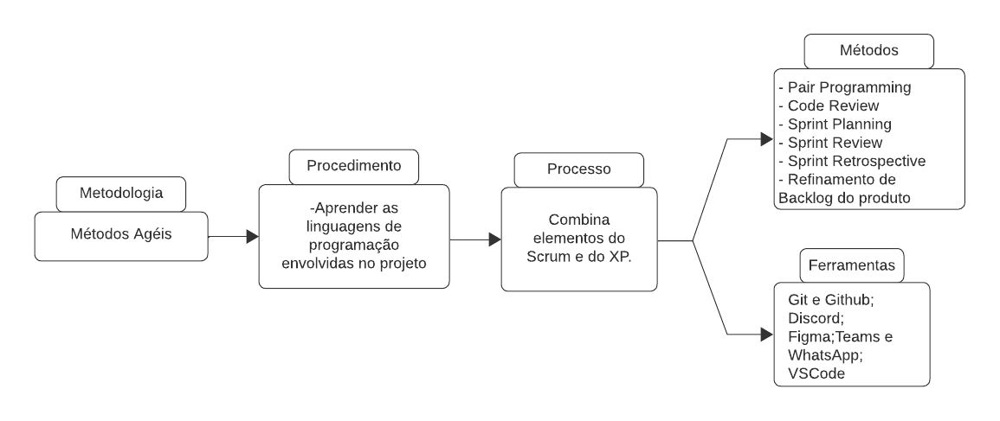

# Ciclo de vida do projeto

|              | Descrição                                                                                                                                                                                                                                                                                                                                                            |
|--------------|----------------------------------------------------------------------------------------------------------------------------------------------------------------------------------------------------------------------------------------------------------------------------------------------------------------------------------------------------------------------|
| Metodologia: | Para maximizar a flexibilidade, facilitar a colaboração e otimizar o tempo disponível, optamos por adotar uma abordagem filosófica baseada em metodologia ágil. Também permite contato constante com o cliente, podendo receber feedback constante ao longo do desenvolvimento do software.                                                                           |
|Procedimento:    | Estudo e aprendizado de novas tecnologias para o desenvolvimento do projeto. Isso envolve explorar linguagens de programação adequadas para o frontend e backend, como JavaScript. Além disso, é fundamental compreender frameworks populares para o frontend, como React e Electron, e para o backend, Express e Nest, mais implementação do banco de dados com MongoDB. Este processo de aprendizado contínuo nos permite selecionar as tecnologias mais adequadas para atender aos requisitos do projeto e garantir sua eficiência e escalabilidade.    | 
| Processo:    | Este processo combina elementos do SCRUM e do XP. Para as práticas e princípios do SCRUM, referenciamos o ‘Guia do SCRUM’.                                                                                                                                                                                                                                           |
| Ferramentas: | Utilizaremos o GitHub para gerenciar submissões e alterações de código, o Discord para reuniões, que oferece controle sobre interações e é reconhecido por sua segurança, e o Figma para a criação de protótipos, designs e colaboração na interface do usuário. Para manter a comunicação síncrona e assíncrona, utilizaremos o Discord, Teams e WhatsApp.          |
| Métodos:     | Como anteriormente citado, aproveitamos dos métodos provenientes do SCRUM/XP como por exemplo: Pair Programming, Code Review Sprint Daily, Sprint Planning, Sprint Review, Sprint Retrospective e Refinamento de Backlog de Produto. Agendaremos encontros semanais para manter a equipe em sintonia e fomentar uma comunicação eficiente durante nossas atividades. |

*Representação gráfica do ciclo de vida do projeto.*